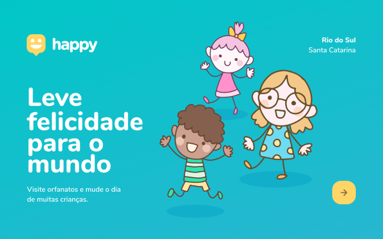

  

## Sobre o projeto:

O Happy é um projeto desenvolvido na semana do dia das crianças para ajudar na localização de Casas de Acolhimento para crianças.

Este é um projeto desenvolvido durante a **[Next Level Week](https://nextlevelweek.com/)**, realizada pela **[Rocketseat](https://www.rocketseat.com.br)**.

## Tecnologias usadas:

Esse projeto foi desenvolvido utilizando essas principais tecnologias:

* [Node.js](https://nodejs.org/en/)
* [Express](https://expressjs.com/pt-br/)
* [SQLite](https://www.sqlite.org/index.html)
* [handlebars](https://handlebarsjs.com/)

## Layout:

Você poderá visualizar os layouts do projeto através dos links abaixo:

- [Layout Web](https://www.figma.com/file/mDEbnoojksG4w8sOxmudh3/Happy-Web?node-id=0%3A1) 
- [Layout Mobile](https://www.figma.com/file/X27FfVxAgy9f5IFa7ONlph/Happy-Mobile?node-id=0%3A1)